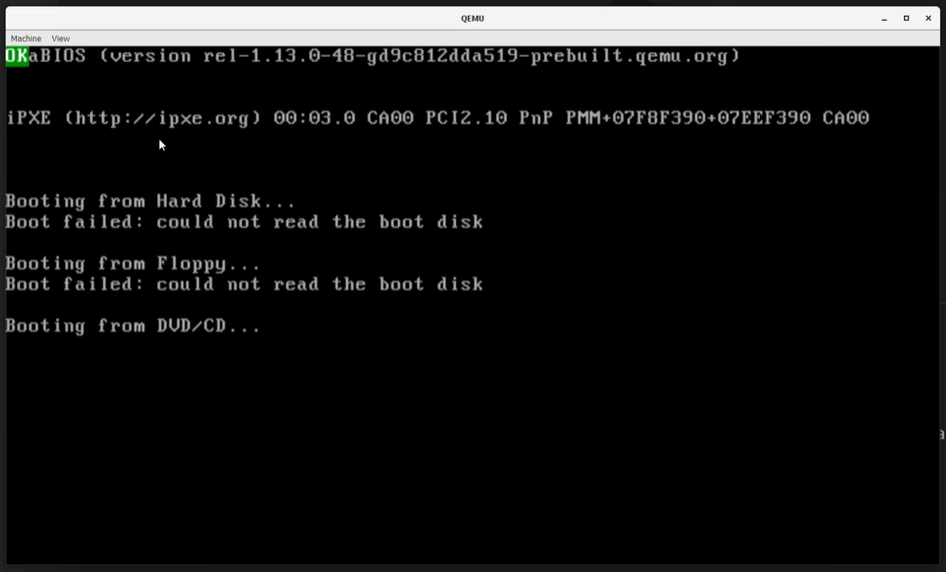

# Kernel OS

A minimal 64-bit x86 bare-metal kernel built from scratch, featuring a custom cross-compilation toolchain, VGA text output, and GRUB multiboot support.

Source code and builds hosted at [abhishekprajapatt/kernel-os](https://github.com/abhishekprajapatt/kernel-os).

## Features
- Custom `x86_64-elf` toolchain with multilib (32/64-bit support) built via Docker.
- VGA text mode printing (yellow "Welcome!" message on boot).
- Long-mode entry with basic paging and GDT setup.
- Bootable GRUB ISO for QEMU emulation.

## Prerequisites
- A text editor such as [VS Code](https://code.visualstudio.com/).
- [Docker](https://www.docker.com/) for creating the build environment.
- [QEMU](https://www.qemu.org/) for emulating the kernel (add to PATH if needed).

## Setup
Build the toolchain and environment image:
- `docker build -f src/Dockerfile -t kernel-os .`

## Build
Enter the build environment (mounts your project dir):
- Linux or macOS: `docker run --rm -it -v "$(pwd)":/root/env kernel-os`
- Windows (CMD): `docker run --rm -it -v "%cd%":/root/env kernel-os`
- Windows (PowerShell): `docker run --rm -it -v "${PWD}:/root/env" kernel-os`
- Note: Use the Linux command for WSL, MSYS2, or Git Bash. Ensure Docker has access to your project drive (Settings > Resources > File Sharing in Docker Desktop).

Inside the container, build the kernel:
- `make all` (sets up ISO, compiles sources, links kernel.bin).

Exit with `exit`. Outputs: `dist/x86_64/kernel.iso`.

## Emulate
Run in QEMU (from host, after building):
- `make run` (uses `qemu-system-x86_64 -cdrom dist/x86_64/kernel.iso -serial stdio`).

Direct QEMU command:
- `qemu-system-x86_64 -cdrom dist/x86_64/kernel.iso`

If boot fails (e.g., BIOS issues):
- Windows: `qemu-system-x86_64 -cdrom dist/x86_64/kernel.iso -L "C:\Program Files\qemu"`
- Linux: `qemu-system-x86_64 -cdrom dist/x86_64/kernel.iso -L /usr/share/qemu/`

For USB boot: Copy ISO to a bootable drive (unverified).

## Cleanup
Remove build artifacts:
- `make clean`

Remove Docker image:
- `docker rmi kernel-os -f`

## Project Structure
- `src/`: Toolchain scripts (build-binutils.sh, build-gcc.sh) and Dockerfile.
- `buildenv/`: GCC multilib patch and config.
- `src/impl/`: Kernel sources (kernel/ for core C, x86_64/ for arch asm/C, intf/ for headers).
- `targets/x86_64/`: Linker script and ISO template.
- `Makefile`: Builds objects, links, generates ISO.

## Troubleshooting
- Toolchain errors: Rebuild Docker image; ensure GMP/MPFR prereqs (handled in Dockerfile).
- QEMU no output: Add `-d cpu` for debug; check multiboot header in `header.asm`.
- Multilib: Verified with `x86_64-elf-gcc -m32 -v`.

Contributions welcome! Fork and PR to [abhishekprajapatt/kernel-os](https://github.com/abhishekprajapatt/kernel-os).
<!--
# Screenshot
 -->
